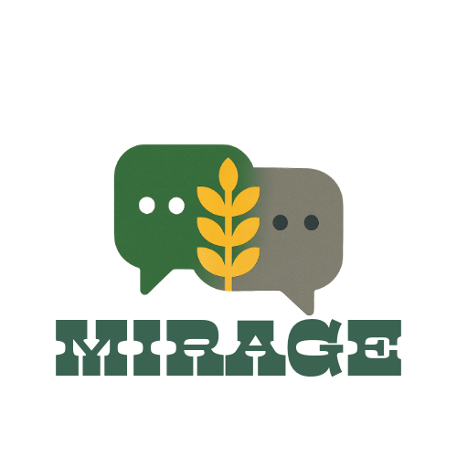

# MIRAGE Benchmark

<div align="center">
  
</div>

## Overview

MIRAGE (Multi-modal Interactive Reasoning and Agricultural Guidance Evaluation) is a comprehensive benchmark for evaluating AI systems in agricultural consultation scenarios. The benchmark consists of two main components:

- [MMST (Multi-Modal Single-Turn)](MMST/README.md) - Single-turn multimodal reasoning tasks
- [MMMT (Multi-Modal Multi-Turn)](MMMT/README.md) - Multi-turn conversational tasks with visual context

## Dataset

The full benchmark dataset is available on Hugging Face:
[MIRAGE-Benchmark/MIRAGE](https://huggingface.co/MIRAGE-Benchmark)

```python
from datasets import load_dataset

# Load MMST datasets
ds_standard = load_dataset("MIRAGE-Benchmark/MIRAGE", "MMST_Standard")
ds_contextual = load_dataset("MIRAGE-Benchmark/MIRAGE", "MMST_Contextual")

# Load MMMT dataset
ds_mmmt = load_dataset("MIRAGE-Benchmark/MIRAGE", "MMMT")
```

## Paper

Our paper is available on arXiv:
[Simulating User Agents for Embodied Conversational-AI](https://arxiv.org/abs/XXXX.XXXXX)

## Citation

If you use our benchmark in your research, please cite our paper:

```bibtex
@article{mirage2024,
  title={Simulating User Agents for Embodied Conversational-AI},
  author={Dongre, Vardhan and Gui, Chi and others},
  journal={arXiv preprint arXiv:XXXX.XXXXX},
  year={2024}
}
```

## License

This project is licensed under the Creative Commons Attribution-ShareAlike 4.0 International License (CC-BY-SA 4.0).

[](https://creativecommons.org/licenses/by-sa/4.0/)

See the [LICENSE](LICENSE) file for details.
